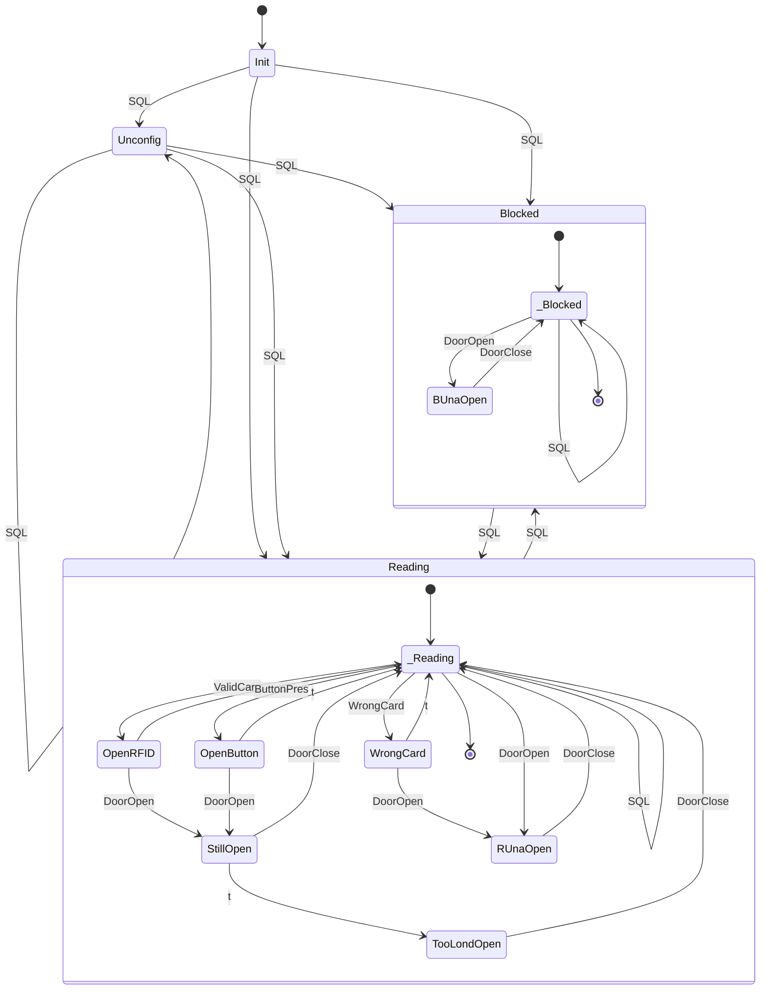
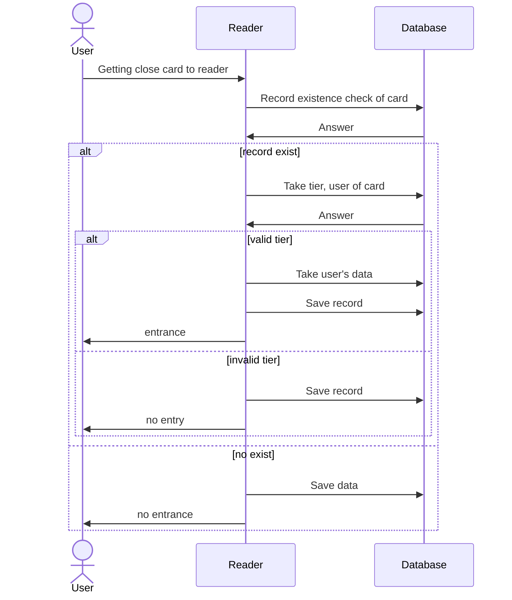

# AccessControlReader
Project of RFID access control reader based on Raspberry Pi with use C#. It uses SQL to check the entrance eligibility and write the time of get in.

## About the App
One used finite state machines to design this software. You can see machine state diagram below.

The app starts the cyclic check of reader status, after boot itself. Reader can be switched off / blocked with SQL.

In time of use RFID card it check the entrance eligibility

## How to run
You need to install .NET on your Raspbian. To do it You should follow the instruction at [learn.microsoft.com](https://learn.microsoft.com/en-us/dotnet/core/install/linux-scripted-manual)
To compile You need to install NuGet packages:
```
PM> NuGet\Install-Package Iot.Device.Bindings -Version 2.2.0
PM> NuGet\Install-Package Microsoft.EntityFrameworkCore -Version 7.0.5
PM> NuGet\Install-Package Microsoft.EntityFrameworkCore.SqlServer -Version 7.0.5
PM> NuGet\Install-Package Microsoft.EntityFrameworkCore.Tools -Version 7.0.5
PM> NuGet\Install-Package NetCoreAudio -Version 1.7.0
PM> NuGet\Install-Package System.Device.Gpio -Version 2.2.0
```

In time of first run App it create .xml file on your desktop. You should change connection string inside it, and if it is necessary, devices properties.


## Hardware
Wire and devices connection schema consistent with default .xml file and most popular components' variant on market is featured bellow.
Project foretakes a use of magnetic sensor to detect a door open, and monostable switch to open the door from inside.

Individual components may use different supply voltages. Make you sure they are connected correctly. Particular attention should be sensitive to the electric-bolt, and secure the rest of components. On schamat at above employed 24V-electic-bolt to open a door lock.
In order to improve user-friendly communication and general make better design, several simple animations have been implemented, which are pesented in the table below. These animations are associated with states of device.

| Info | RFID | Blockade | No entry | Entrance | Alert | Exclamation mark |
|:---: |:---:| :---:| :---: |:---:| :---:| :---:|
|  |  |  |  |  |  |  |

---
Source of noises used at project: https://mixkit.co <br>
License: [Creative Commons Attribution-NonCommercial-ShareAlike 4.0](https://creativecommons.org/licenses/by-nc-sa/4.0/legalcode)
